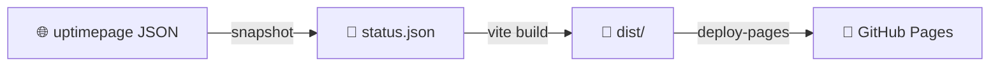

<picture>
  <source media="(prefers-color-scheme: dark)"
          srcset="https://raw.githubusercontent.com/ISC-HEI/isc-logos/main/white/ISC%20Logo%20inline%20white%20v3%20-%20large.webp">
  
</picture>

[](https://github.com/ISC-HEI/isc-uptime/actions/workflows/deploy.yml)
[](https://isc-hei.github.io/isc-uptime/)

# ISC status page

Static, ISC-themed front for the public status of the ISC services (HES-SO Valais-Wallis).
The monitoring itself runs on [uptimepage](https://isc3.uptimepage.dev/status); this repo only
owns the design: a [Vite](https://vite.dev/) + vanilla TypeScript page built with [Bun](https://bun.sh/)
that wears the shared ISC look (header, footer, tokens and theme of `@isc-hei/design`) and is
redeployed to GitHub Pages by CI every five minutes.

## Features

- **90-day history** — one strip per service on a shared month axis, coloured with the ISC petal palette
- **Uptime percentage** — per service and overall, computed from the incident timeline over the observed window
- **Incidents and maintenance** — active, recent and planned, with Swiss time and durations
- **Light and dark theme** — two-way toggle persisted under `isc.theme`, shared with the ISC Hub
- **Snapshot-based** — no server, no CORS proxy: CI fetches the public JSON and rebuilds the site

## Quick Start

```bash
# Install dependencies
bun install

# Refresh src/data/status.json from the live API
bun run snapshot

# Dev server with hot reload
bun run dev
```

## Environment variables (`.env`)

`.env` is committed (it holds no secret) and read by Vite at build time; the workflow sets the
same value as `STATUS_BASE` for the snapshot script.

```bash
# ── uptimepage (required) ─────────────────────────────────────────────
VITE_STATUS_BASE=https://isc3.uptimepage.dev   # public status page, no trailing slash
```

| Variable | Required | Default | Purpose |
|---|---|---|---|
| `VITE_STATUS_BASE` | yes | — | Origin of the uptimepage instance (permalinks, RSS, live fetch) |
| `STATUS_BASE` | for CI only | `VITE_STATUS_BASE` | Same origin, read by `scripts/snapshot.ts` |

## Pipeline

The public API sends no CORS headers, so a browser on GitHub Pages cannot call it. CI does it instead:

1. **`snapshot`** — fetches `/api/public/v1/status` into `src/data/status.json`
2. **Builds** — Vite bundles the page with the snapshot embedded
3. **Deploys** — `actions/deploy-pages` publishes `dist/`, on push and every five minutes by cron



If CORS is ever enabled upstream, `src/main.ts` already retries a live fetch every 30 s and
switches over on its own. GitHub disables scheduled workflows after 60 days without a commit;
a trivial commit every couple of months keeps the cron alive.

## Web viewer

**→ [Open the status page](https://isc-hei.github.io/isc-uptime/)**

For a custom domain, rename `public/CNAME.example` to `public/CNAME` and add the DNS record.

## Design

The app is not Vue, so it cannot import the components of `@isc-hei/design`. It vendors the
package's tokens and the CSS of the ported components in `src/isc-design.css` (ISCHeader, Footer,
`.isc-fab`, `[data-tooltip]`) and renders the same markup from `src/render.ts`.
When the package changes upstream, re-vendor those blocks by hand.

```
scripts/snapshot.ts   fetch public JSON → src/data/status.json
src/types.ts          payload types
src/format.ts         French labels, Zurich time, state normalisation
src/uptime.ts         availability from the incident timeline
src/theme.ts          two-way theme, localStorage isc.theme
src/render.ts         HTML rendering (header, hero, axis, strips, uptime, incidents, footer)
src/isc-design.css    vendored @isc-hei/design subset
src/style.css         page styles on top of the design tokens
src/main.ts           paint snapshot, theme toggle, strip popovers, opportunistic live refresh
```

---

## License

Copyright © 2026 P.-A. Mudry / ISC — HES-SO Valais. Released under the
[MIT License](https://opensource.org/license/mit).

---

*Made with ♥ by mui, 2026*
